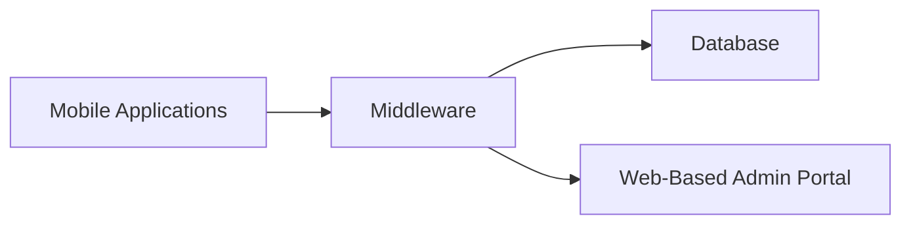

# DADproject
 Group Nabil

# IoT-Based Locker System

## Overview

This project involves the development of an IoT-based locker system designed to facilitate secure and efficient parcel management. The system comprises several components, including mobile applications, a web-based administration portal, and middleware to handle communication and data management.

## Applications Involved

1. **Mobile Application for Administrators, Recipients, and Couriers**
2. **Web-Based Administration Portal**
3. **Middleware for Data Handling and Communication**

## Brief Explanation of Each Application

### Mobile Application
- **Administrators**: Manage lockers, track parcel status, and oversee system operations.
- **Recipients**: Receive notifications, track parcel status, and access lockers.
- **Couriers**: Deliver parcels, update delivery status, and manage routes.

### Web-Based Administration Portal
- A comprehensive dashboard for administrators to manage users, lockers, and generate reports.

### Middleware
- Facilitates communication between the mobile apps, web portal, and the database.
- Handles RESTful API requests, socket communication, and data processing.

## Architecture/Layer Diagram

