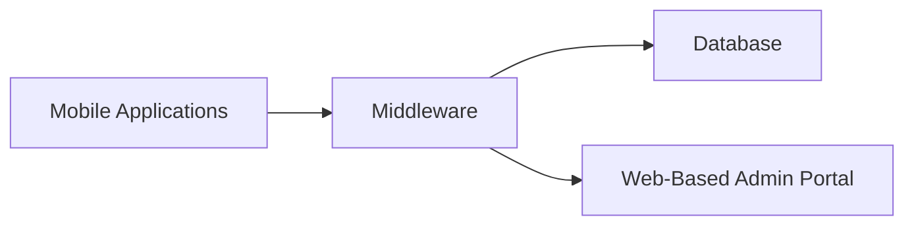

# DADproject
 Group Nabil

# IoT-Based Locker System

## Overview

This project involves the development of an IoT-based locker system designed to facilitate secure and efficient parcel management. The system comprises several components, including mobile applications, a web-based administration portal, and middleware to handle communication and data management.

## Applications Involved

1. **Mobile Application for Administrators, Recipients, and Couriers**
2. **Web-Based Administration Portal**
3. **Middleware for Data Handling and Communication**

## Brief Explanation of Each Application

### Mobile Application
- **Administrators**: Manage lockers, track parcel status, and oversee system operations.
- **Recipients**: Receive notifications, track parcel status, and access lockers.
- **Couriers**: Deliver parcels, update delivery status, and manage routes.

### Web-Based Administration Portal
- A comprehensive dashboard for administrators to manage users, lockers, and generate reports.

### Middleware
- Facilitates communication between the mobile apps, web portal, and the database.
- Handles RESTful API requests, socket communication, and data processing.

## Architecture/Layer Diagram



# Locker Management System

This repository contains the Locker Management System API, which provides functionalities for user management, locker management, and parcel management. The system also includes real-time notifications via WebSocket and supports report generation.

## URL Endpoints

### User Management

- **Register a new user**
  - `POST /api/users/register`

- **User login**
  - `POST /api/users/login`

- **Retrieve user details by ID**
  - `GET /api/users/{id}`

- **Update user details**
  - `PUT /api/users/{id}`

- **Delete user**
  - `DELETE /api/users/{id}`

### Locker Management

- **Add a new locker**
  - `POST /api/lockers`

- **Retrieve all lockers**
  - `GET /api/lockers`

- **Retrieve locker details by ID**
  - `GET /api/lockers/{id}`

- **Update locker details**
  - `PUT /api/lockers/{id}`

- **Delete locker**
  - `DELETE /api/lockers/{id}`

### Parcel Management

- **Add a new parcel**
  - `POST /api/parcels`

- **Retrieve all parcels**
  - `GET /api/parcels`

- **Retrieve parcel details by ID**
  - `GET /api/parcels/{id}`

- **Update parcel details**
  - `PUT /api/parcels/{id}`

- **Delete parcel**
  - `DELETE /api/parcels/{id}`

### Socket Endpoints

- **WebSocket endpoint for real-time notifications**
  - `ws://{middleware_url}/notifications`

## Functions/Features in the Middleware

- **User Authentication and Authorization**
- **Locker Management**
- **Parcel Tracking and Management**
- **Real-Time Notifications**
- **Report Generation**

## Database and Tables

**Database: `locker_system`**

### Users Table

| Column    | Type    | Description         |
|-----------|---------|---------------------|
| id        | Integer | Primary Key         |
| username  | Varchar |                     |
| password  | Varchar |                     |
| role      | Varchar | (Admin, Courier, Recipient) |
| email     | Varchar |                     |

### Lockers Table

| Column    | Type    | Description |
|-----------|---------|-------------|
| id        | Integer | Primary Key |
| location  | Varchar |             |
| status    | Varchar | (Available, Occupied) |

### Parcels Table

| Column       | Type    | Description                |
|--------------|---------|----------------------------|
| id           | Integer | Primary Key                |
| recipient_id | Integer | Foreign Key (Users)        |
| locker_id    | Integer | Foreign Key (Lockers)      |
| status       | Varchar | (Pending, Delivered, Retrieved) |

### Notifications Table

| Column    | Type       | Description                |
|-----------|------------|----------------------------|
| id        | Integer    | Primary Key                |
| user_id   | Integer    | Foreign Key (Users)        |
| message   | Text       |                            |
| timestamp | Timestamp  |                            |

## Installation and Setup

To install and run the Locker Management System, follow these steps:

1. Clone the repository:
   ```bash
   git clone https://github.com/nabil0p/DADproject
   cd DADproject
```
